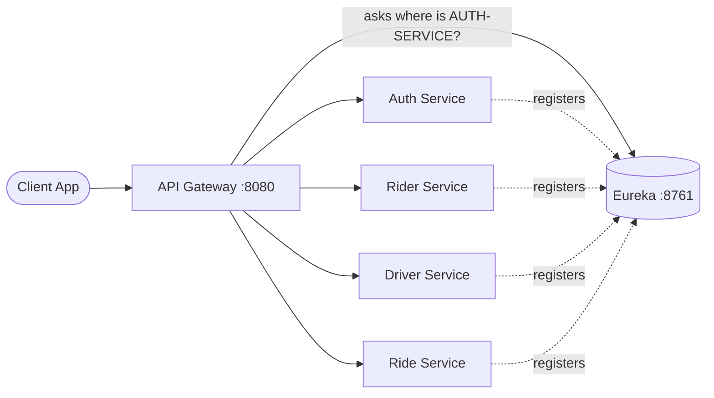
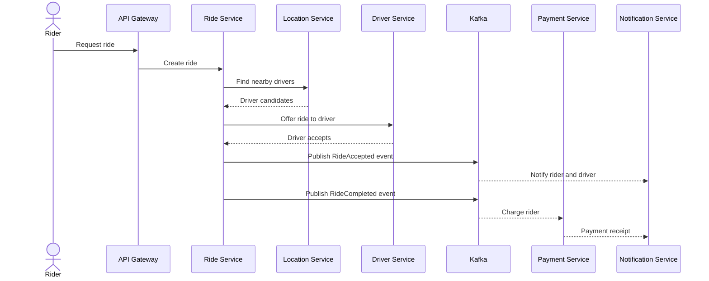

<div align="center">

# 🚖 RideNow

### A distributed ride-hailing platform built with Spring Boot microservices


</div>

---

## 📖 About

RideNow is an Uber/Ola style ride-hailing backend, designed as a set of small, independent services instead of one big application. Riders request rides, nearby drivers get matched, trips are tracked live, and payments and notifications happen behind the scenes.

The goal of this project is to learn and demonstrate real microservice engineering: service discovery, an API gateway, event-driven communication, caching, fault tolerance and containerized deployment.

The repo is built **incrementally**. Every milestone is a separate commit, so the Git history shows how the system grew step by step.

---

## 🏗️ Architecture

### Big picture (sketch)

```
                        +----------------------+
                        |   React Frontend     |
                        |   (Rider / Driver)   |
                        +-----------+----------+
                                    |
                                    v
                        +----------------------+
                        |     API GATEWAY      |
                        |     (port 8080)      |
                        |  routing, JWT, limits|
                        +-----------+----------+
                                    |
         +-------------+------------+------------+-------------+
         |             |            |            |             |
         v             v            v            v             v
     +-------+     +-------+    +--------+   +--------+    +---------+
     | AUTH  |     | RIDER |    | DRIVER |   |  RIDE  |    | PAYMENT |
     +-------+     +-------+    +--------+   +--------+    +---------+
                                      |           |
                                      v           v
                                 +----------+  +--------------+
                                 | LOCATION |  | NOTIFICATION |
                                 +----------+  +--------------+

   +-------------------------------------------------------------+
   |   EUREKA SERVICE DISCOVERY (port 8761)                      |
   |   Every service registers here, the gateway looks them up   |
   +-------------------------------------------------------------+

   +-------------------------------------------------------------+
   |   Kafka (events)  |  Redis (cache, live data)  |  Databases |
   +-------------------------------------------------------------+
```

### How services find each other



### Target ride booking flow



> The diagrams above show the target design. See the status table below for what is built today.

---

## 🧩 Services

| Service | Purpose | Status |
|---|---|---|
| `service-discovery` | Eureka registry, services register and find each other here | ✅ Done |
| `api-gateway` | Single entry point, routing, later JWT checks | ✅ Done |
| `auth-service` | Signup, login, JWT tokens | ⏳ Planned |
| `rider-service` | Rider profiles | ⏳ Planned |
| `driver-service` | Driver profiles and availability | ⏳ Planned |
| `location-service` | Live driver locations | ⏳ Planned |
| `ride-service` | Ride lifecycle and driver assignment | ⏳ Planned |
| `payment-service` | Fare calculation and payments | ⏳ Planned |
| `notification-service` | Alerts to riders and drivers | ⏳ Planned |

---

## 🛠️ Tech Stack

| Layer | Technology |
|---|---|
| Language | Java 21 |
| Framework | Spring Boot 4.1.1, Spring Cloud |
| Service discovery | Netflix Eureka |
| API gateway | Spring Cloud Gateway |
| Messaging | Apache Kafka |
| Caching | Redis |
| Databases | PostgreSQL, MySQL, MongoDB |
| Security | Spring Security, JWT |
| Inter-service calls | OpenFeign |
| Containers | Docker, Docker Compose |
| Frontend | React + TypeScript |
| Build tool | Maven |

---

## 📁 Project Structure

```
RideNow/
├── service-discovery/     Eureka server
├── api-gateway/           Spring Cloud Gateway
├── auth-service/          (planned)
├── rider-service/         (planned)
├── driver-service/        (planned)
├── location-service/      (planned)
├── ride-service/          (planned)
├── payment-service/       (planned)
├── notification-service/  (planned)
├── infrastructure/        Docker and environment setup
├── docs/                  Design notes and diagrams
├── .gitignore
├── README.md
└── pom.xml                Root Maven parent
```

---

## 🚀 Getting Started

### Prerequisites

- Java 21 or higher
- Maven 3.9+
- Git

### Run locally

**1. Clone the repo**

```bash
git clone https://github.com/ShivamNayak-dev/RideNow.git
cd RideNow
```

**2. Start Eureka first**

```bash
cd service-discovery
mvn spring-boot:run
```

Open the dashboard at http://localhost:8761

**3. Start the API Gateway in a second terminal**

```bash
cd api-gateway
mvn spring-boot:run
```

Refresh the Eureka dashboard. You should see `API-GATEWAY` with status `UP`.

---

## 🗺️ Roadmap

- [x] Repository structure and Git workflow
- [x] Eureka service discovery
- [x] API Gateway registered with Eureka
- [ ] Maven parent for shared Spring Boot and Spring Cloud versions
- [ ] Auth service with JWT
- [ ] Rider and driver services
- [ ] Location service with Redis
- [ ] Ride service and driver assignment
- [ ] Kafka event streaming
- [ ] Payment and notification services
- [ ] Fault tolerance (retries, circuit breakers)
- [ ] Docker Compose for the full stack
- [ ] React frontend
- [ ] Observability (metrics, tracing, logging)

---

## 🧾 Commit Convention

This repo follows Conventional Commits:

| Prefix | Meaning |
|---|---|
| `feat:` | New feature |
| `fix:` | Bug fix |
| `chore:` | Setup and maintenance |
| `docs:` | Documentation only |
| `refactor:` | Code cleanup, same behavior |
| `test:` | Tests |

---

## 👤 Author

**Shivam Nayak**
GitHub: [@ShivamNayak-dev](https://github.com/ShivamNayak-dev)

---

<div align="center">

⭐ If you find this project useful, consider giving it a star.

</div>
